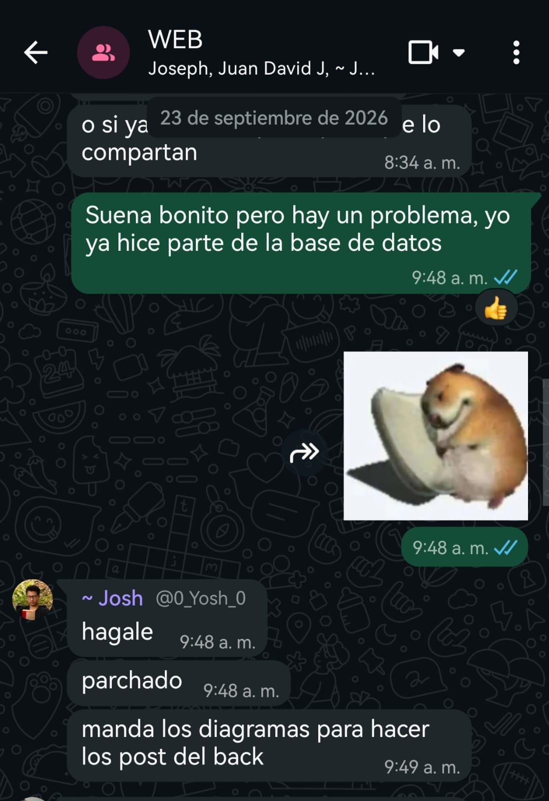
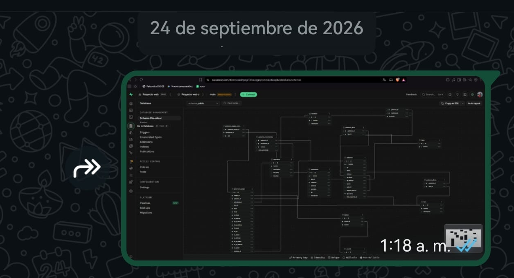
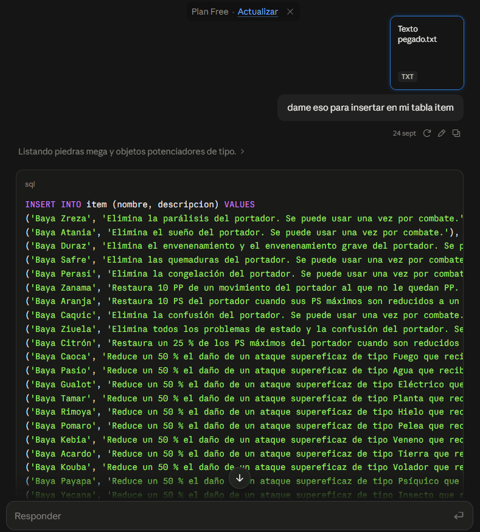
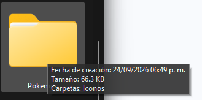
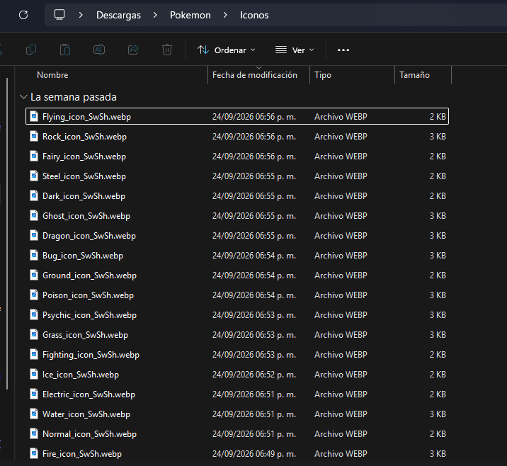
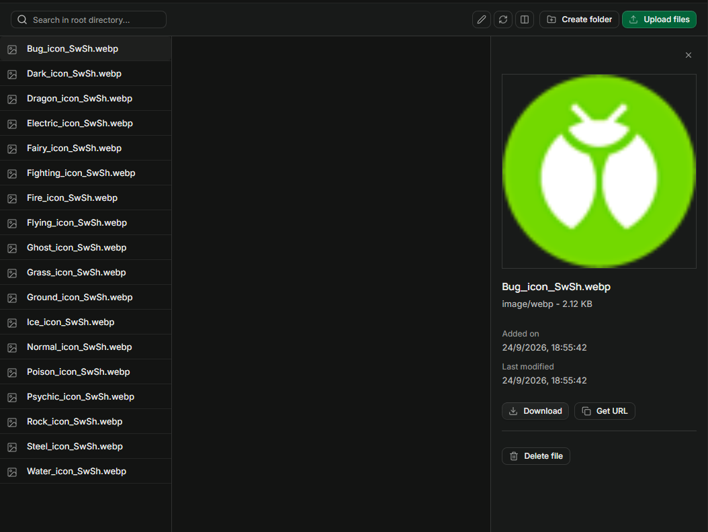
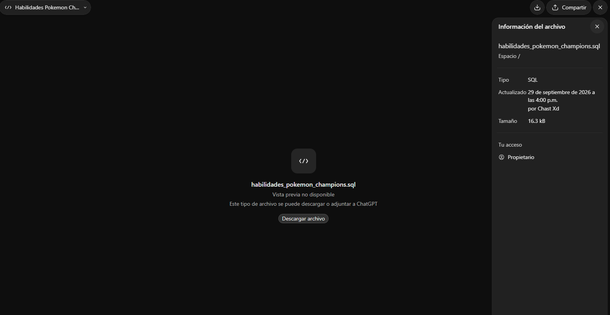
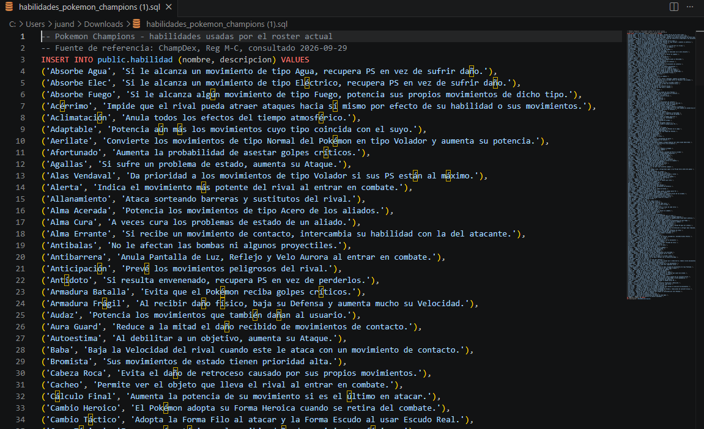

# Evidencias de que andaba trabajando en la base de datos

En esta imagen se estaba dividiendo el trabajo, mi compañero “Josh” quería hacer la base de datos de la entrega pero yo ya había avanzado en la base de datos días previos, y pues me dejó el trabajo.

Esta foto la mandé a un compañero el mismo día para que viera el progreso de las tablas (aún sin datos).

Si bien no puedo sacar un registro de la creación de las tablas puesto que Supabase no maneja algo por estilo (y sus logs solo son guardados temporalmente x 24 horas), tengo conversaciones con IAs donde les pido ayuda a la hora del insert por la cantidad de datos enormes que se manejan al ser una web de Pokémon.

Aquí le entrego un txt que básicamente era un copia y pega de los ítems y sus descripciones sacadas de wikidex.net, y para facilitarme el insert de los datos pues se hizo con la IA.

Aquí en mi computador hay una carpeta que tiene las imágenes correspondientes a los 18 tipos de Pokémon que posteriormente subí a la base de datos.

Ahí se ven las fechas.

Y pues básicamente así fue mi trabajo las tablas las hice yo, no tengo forma de mostrarlo puesto que ni Supabase me lo permite ver, y ni tengo algún chat con IA sobre eso, y respecto los datos al ser extensos sí usé IA, como los ítems que son más de 80, los movimientos Pokémon que son 512, y demás.

Aquí se ve otro insert esta vez hecho por ChatGPT y se ve que me creó el archivo el 29 de septiembre (aquí lo muestro para que se vea que solo es un insert).

## Aclaracion
En la carpeta insertSQL se encuentran ya los archivos de los insert generados por IA, los otros menos extensos como tipos (eran 18) y naturalezas (25) si fueron manual desde el editor de tablas de supabase
[Ver los inserts](./insertSQL/)

