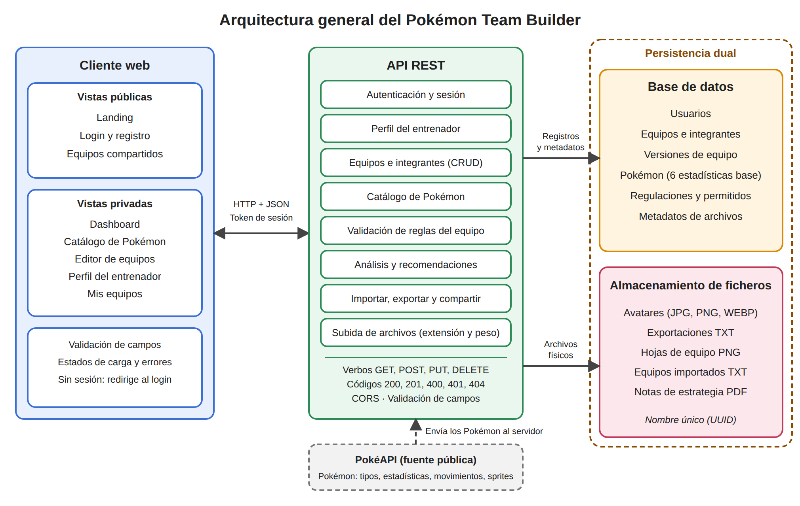

# Pokémon Team Builder

Aplicación web full-stack para crear, validar, analizar, guardar y compartir equipos de **Pokémon Champions**.

> Pokémon y Pokémon Champions son marcas de Nintendo, Creatures Inc. y GAME FREAK. Este es un proyecto académico sin fines comerciales y sin afiliación oficial.

## Tabla de contenido

1. [Contexto](#1-contexto)
2. [Problema](#2-problema)
3. [Objetivos](#3-objetivos)
4. [Público objetivo y roles](#4-público-objetivo-y-roles)
5. [Historias de usuario](#5-historias-de-usuario)
6. [Alcance](#6-alcance)
7. [Supuestos y restricciones](#7-supuestos-y-restricciones)
8. [Arquitectura general](#8-arquitectura-general)
9. [Modelo de datos](#9-modelo-de-datos)

---

## 1. Contexto

Pokémon Champions es el juego de combate de The Pokémon Company lanzado el 8 de abril de 2026 para Nintendo Switch y, desde junio de 2026, para iOS y Android. Está centrado solo en el combate: equipos de seis Pokémon, formatos de Combate Individual y Combate Doble, Megaevoluciones y modos Clasificatorio, Casual y Privado. Desde 2026 es el software oficial del circuito competitivo (VGC) y del Campeonato Mundial. Sus reglas cambian por temporadas mediante regulaciones que definen qué Pokémon y Megaevoluciones están permitidos.

Armar un equipo exige cruzar tipos, estadísticas, habilidades, movimientos, objetos y la regulación vigente. El juego no ofrece un lugar para documentar un equipo ni comparar sus versiones.

---

## 2. Problema

**Dispersión de la información y verificación manual de reglas en la construcción de equipos por jugadores competitivos de Pokémon Champions del circuito VGC, durante las regulaciones de la temporada 2026.**

Los jugadores competitivos de Pokémon Champions del circuito VGC consultan en fuentes separadas (wikis, hojas de cálculo, capturas de pantalla y notas personales) los tipos, las estadísticas base, las habilidades, los movimientos, los objetos y la regulación vigente que necesitan para definir un equipo. No existe un modelo de datos común que relacione estos elementos con un equipo concreto, ni un registro estructurado de los equipos de cada jugador, de sus versiones y de sus archivos asociados. La verificación de las reglas de cada regulación, el cálculo de debilidades y coberturas de tipo, la identificación de la estadística base más baja y el registro de cambios dependen de procedimientos manuales. Se desconoce qué datos y reglas representan un equipo legal según el formato y la regulación, de qué fuentes obtenerlos y mantenerlos actualizados, y qué información conservar para consultar, comparar y compartir cada equipo.

**Pregunta de investigación:** ¿Cómo representar, validar y analizar de forma integrada un equipo de Pokémon Champions según su formato y la regulación vigente, y conservar su configuración, versiones y archivos asociados?

---

## 3. Objetivos

### Objetivo general

Diseñar e implementar una aplicación web full-stack, con cliente y API REST desacoplados y persistencia dual (base de datos y sistema de archivos), que permita a jugadores de Pokémon Champions construir, validar, analizar, guardar y compartir equipos según el formato y la regulación vigente.

### Objetivos específicos

#### OE1

Modelar en una base de datos los usuarios, el catálogo de Pokémon, las regulaciones, los equipos, sus versiones y los metadatos de archivos.

- **Responde a:** No hay un modelo de datos común.

#### OE2

Cargar el catálogo desde una fuente pública (PokéAPI) y registrar la lista de Pokémon permitidos por regulación.

- **Responde a:** Se desconoce de qué fuentes obtener y mantener los datos.

#### OE3

Implementar la creación y edición de equipos de hasta seis integrantes con su configuración completa, y su validación en el servidor contra el formato y la regulación.

- **Responde a:** Verificación manual de reglas.

#### OE4

Calcular el análisis de debilidades y cobertura de tipos y recomendar Pokémon según la estadística base más baja del equipo.

- **Responde a:** Cálculo manual de debilidades y estadísticas.

#### OE5

Guardar los equipos con historial de versiones y los archivos subidos o generados en un sistema de ficheros, con sus metadatos en la base de datos.

- **Responde a:** No hay registro de versiones ni de archivos.

#### OE6

Implementar autenticación y control de rutas públicas y privadas, y permitir importar, exportar y compartir equipos.

- **Responde a:** La información del equipo no es consultable ni compartible.

---

## 4. Público objetivo y roles

### Perfiles de jugador

#### Jugador nuevo

- **Necesidad principal:** Entender qué Pokémon combinan bien y detectar debilidades evidentes.

#### Jugador de clasificatorias

- **Necesidad principal:** Probar variantes de un equipo y guardar su historial por temporada.

#### Jugador de torneos (VGC)

- **Necesidad principal:** Validar contra la regulación vigente y exportar la hoja de equipo.

#### Creador de contenido o comunidad

- **Necesidad principal:** Publicar equipos y compartirlos con un enlace o imagen.

### Roles del sistema

- **Usuario registrado:** gestiona sus propios equipos.
- **Visitante:** solo accede a las vistas públicas (landing, login, registro y equipos compartidos públicamente).

---

## 5. Historias de usuario

Las historias se agrupan por prioridad. Las de prioridad alta conforman el núcleo (MVP) del proyecto.

### Prioridad alta (MVP)

#### HU-01

**Como** visitante, **quiero** conocer la herramienta en la landing **para** decidir si creo una cuenta.

- **Módulo:** Landing
- **Prioridad:** Alta
- **Criterios de aceptación:**
  - La landing es pública y responsive
  - Tiene botones "Crear cuenta" e "Iniciar sesión"

#### HU-02

**Como** visitante, **quiero** registrarme con correo y contraseña **para** guardar mis equipos.

- **Módulo:** Auth
- **Prioridad:** Alta
- **Criterios de aceptación:**
  - Valida campos en cliente y servidor
  - Rechaza correo ya registrado
  - La contraseña se guarda con hash

#### HU-03

**Como** usuario, **quiero** iniciar y cerrar sesión **para** proteger mi información.

- **Módulo:** Auth
- **Prioridad:** Alta
- **Criterios de aceptación:**
  - Credenciales incorrectas muestran error
  - Sin sesión, las vistas privadas redirigen al login
  - El logout invalida la sesión

#### HU-04

**Como** usuario, **quiero** buscar Pokémon por nombre y tipo **para** elegir integrantes rápidamente.

- **Módulo:** Catálogo
- **Prioridad:** Alta
- **Criterios de aceptación:**
  - Filtra por nombre, tipo y regulación
  - Muestra estado de carga
  - La ficha muestra tipos, estadísticas y habilidades

#### HU-05

**Como** usuario, **quiero** crear un equipo de hasta seis Pokémon con su configuración **para** prepararlo para Pokémon Champions.

- **Módulo:** Editor
- **Prioridad:** Alta
- **Criterios de aceptación:**
  - Guarda habilidad, objeto, naturaleza, cuatro movimientos y estadísticas por integrante
  - No admite más de seis integrantes

#### HU-06

**Como** usuario, **quiero** que el sistema valide el equipo contra la regulación **para** no llevar un equipo ilegal al juego.

- **Módulo:** Validación
- **Prioridad:** Alta
- **Criterios de aceptación:**
  - Rechaza especies no permitidas, repetidas u objetos repetidos
  - Responde 400 con el campo afectado
  - El cliente muestra el error junto al campo

#### HU-09

**Como** usuario, **quiero** editar, duplicar y eliminar mis equipos **para** mantener mi colección ordenada.

- **Módulo:** Equipos
- **Prioridad:** Alta
- **Criterios de aceptación:**
  - Cada operación se refleja en la base de datos
  - Pide confirmación antes de eliminar

### Prioridad media

#### HU-07

**Como** usuario, **quiero** ver debilidades y cobertura del equipo **para** corregir mis puntos débiles.

- **Módulo:** Análisis
- **Prioridad:** Media
- **Criterios de aceptación:**
  - Muestra la tabla frente a los 18 tipos
  - Se actualiza al modificar el equipo

#### HU-08

**Como** usuario, **quiero** recibir recomendaciones de Pokémon con alta la estadística más baja de mi equipo **para** equilibrarlo.

- **Módulo:** Recomendaciones
- **Prioridad:** Media
- **Criterios de aceptación:**
  - Detecta la estadística de menor promedio
  - Sugiere hasta cinco Pokémon
  - Nunca sugiere especies repetidas ni no permitidas

#### HU-10

**Como** usuario, **quiero** exportar el equipo como TXT o PNG **para** usarlo o publicarlo fuera de la app.

- **Módulo:** Exportación
- **Prioridad:** Media
- **Criterios de aceptación:**
  - El archivo se guarda con nombre único y metadatos en la BD
  - Se puede descargar

#### HU-11

**Como** usuario, **quiero** importar un equipo desde un TXT **para** no reescribirlo a mano.

- **Módulo:** Importación
- **Prioridad:** Media
- **Criterios de aceptación:**
  - Valida extensión y peso
  - Crea el equipo o informa errores de formato

#### HU-12

**Como** usuario, **quiero** subir capturas y notas PDF a un equipo **para** documentar cómo me va en combate.

- **Módulo:** Archivos
- **Prioridad:** Media
- **Criterios de aceptación:**
  - Acepta JPG, PNG y PDF dentro del límite de peso
  - El archivo queda asociado al equipo

### Prioridad baja

#### HU-13

**Como** usuario, **quiero** ver y restaurar versiones anteriores **para** comparar cambios entre temporadas.

- **Módulo:** Historial
- **Prioridad:** Baja
- **Criterios de aceptación:**
  - Cada guardado crea una versión
  - Se puede restaurar una versión previa

#### HU-14

**Como** usuario, **quiero** compartir un equipo con un enlace público **para** mostrarlo a otros jugadores.

- **Módulo:** Compartir
- **Prioridad:** Baja
- **Criterios de aceptación:**
  - El enlace es de solo lectura
  - El dueño puede activarlo y desactivarlo

#### HU-15

**Como** usuario, **quiero** subir mi foto de perfil **para** personalizar mi cuenta.

- **Módulo:** Perfil
- **Prioridad:** Baja
- **Criterios de aceptación:**
  - Acepta JPG, PNG y WEBP
  - El avatar queda guardado con metadatos en la BD

---

## 6. Alcance

### Dentro del alcance

- Gestión de cuentas, perfil y sesión.
- Catálogo de Pokémon con filtros y lista de permitidos por regulación.
- CRUD de equipos e integrantes, con validación, análisis de tipos y recomendaciones.
- Importación, exportación (TXT y PNG), adjuntos, historial de versiones y enlaces para compartir.
- Persistencia dual de todos los archivos del usuario.

### Fuera del alcance

- Simular combates o calcular daño exacto entre Pokémon.
- Conectarse con la cuenta de Nintendo o transferir equipos directamente al juego.
- Estadísticas de uso del metajuego obtenidas de partidas clasificatorias.
- Funciones sociales avanzadas como comentarios, seguidores o chat.

### Priorización: núcleo (MVP) y extensiones

**Núcleo (MVP), prioridad alta:**

- Landing, registro, login y logout (HU-01 a HU-03)
- Catálogo y búsqueda (HU-04)
- Crear y validar equipos (HU-05, HU-06)
- Editar, duplicar y eliminar (HU-09)

**Extensiones, prioridad media y baja:**

- Análisis y recomendaciones (HU-07, HU-08)
- Exportar e importar (HU-10, HU-11)
- Capturas y notas PDF (HU-12)
- Historial, enlaces públicos y avatar (HU-13 a HU-15)

---

## 7. Supuestos y restricciones

### Supuestos

- PokéAPI aporta tipos, estadísticas, habilidades, movimientos y sprites suficientes para el catálogo.
- El equipo registrará manualmente la lista de Pokémon permitidos por regulación, tomada de fuentes públicas.
- Las reglas de validación se limitan a las descritas en este documento.

### Restricciones

- **Tiempo:** Avance 1 en la semana 9, Avance 2 en la semana 13 y entrega final en la semana 15 o 16.
- **Equipo:** mínimo 4 integrantes, con aportes verificables en Git.
- **Tecnología:** cliente y servidor separados, base de datos SQL o NoSQL, y persistencia dual obligatoria.
- **Datos:** la lista de permitidos por regulación no viene de una fuente automática.
- **Legal:** Pokémon y Pokémon Champions son marcas de Nintendo, Creatures Inc. y GAME FREAK. Es un proyecto académico, sin fines comerciales y sin afiliación oficial.

---

## 8. Arquitectura general

El sistema se organiza en un cliente web desacoplado de un servidor propio que expone una API REST. Los datos se guardan de forma dual: los registros en una base de datos y los archivos en un sistema de ficheros.

### Diagrama de arquitectura

### Componentes

- **Cliente web:** interfaz que consume la API REST. Separa las vistas públicas de las privadas, muestra estados de carga y presenta los errores de red o validación al usuario.
- **API REST:** servidor independiente que expone endpoints con verbos semánticos (GET, POST, PUT y DELETE) y códigos de estado HTTP estándar (200, 201, 400, 401 y 404). Intercambia información en JSON, tiene CORS configurado para el cliente y valida las credenciales y los equipos contra la base de datos.
- **Base de datos:** almacena los usuarios, los equipos y sus integrantes, las versiones, el catálogo de Pokémon con sus seis estadísticas base, las regulaciones y los metadatos de los archivos.
- **Almacenamiento de ficheros:** guarda los archivos físicos, ya sea en el disco del servidor o en un servicio cloud. El contenido de los archivos nunca se almacena dentro de la base de datos.

### Comunicación y seguridad

- El cliente y el servidor se comunican mediante peticiones HTTP asíncronas con intercambio en JSON.
- Las contraseñas se guardan cifradas (hash) y, al iniciar sesión, el servidor emite un token de sesión.
- Si alguien intenta abrir una vista privada sin sesión, el cliente lo redirige al login.
- Los campos se validan tanto en el cliente como en el servidor.

### Origen de los datos

- El catálogo de Pokémon (tipos, estadísticas, habilidades, movimientos y sprites) se carga en el servidor desde una fuente pública como PokéAPI.
- La lista de Pokémon permitidos por regulación se registra en la base de datos.

### Persistencia dual

Todo lo que el usuario sube o el sistema genera se guarda en dos lugares: el archivo físico en el sistema de ficheros y sus metadatos en la base de datos (nombre original, nombre único generado con UUID, tipo MIME, peso, ruta o URL, fecha de subida, autor y equipo o perfil al que pertenece). Antes de guardar, el servidor valida la extensión y el tamaño máximo del archivo.

### Flujo general de la aplicación

1. **Llegada:** el visitante entra a la landing y elige crear una cuenta o iniciar sesión.
2. **Autenticación:** se registra o inicia sesión, y el servidor verifica las credenciales contra la base de datos.
3. **Dashboard:** el usuario ve sus equipos y accesos rápidos para crear o importar uno.
4. **Construcción:** en el editor elige formato y regulación, busca Pokémon en el catálogo y configura cada integrante.
5. **Validación, análisis y recomendaciones:** el servidor valida las reglas, calcula debilidades y cobertura, y sugiere Pokémon.
6. **Guardado dual:** el equipo queda en la base de datos y su archivo de exportación en el almacenamiento de ficheros, con sus metadatos registrados.
7. **Consulta y gestión:** desde "Mis equipos" el usuario edita, duplica, elimina, descarga o comparte sus equipos y revisa versiones anteriores.
8. **Cierre de sesión:** el logout invalida la sesión y devuelve al usuario a la landing.
---

## 9. Modelo de datos

### Diagrama entidad-relación

